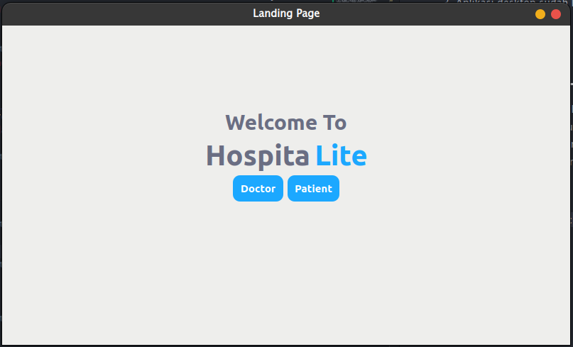
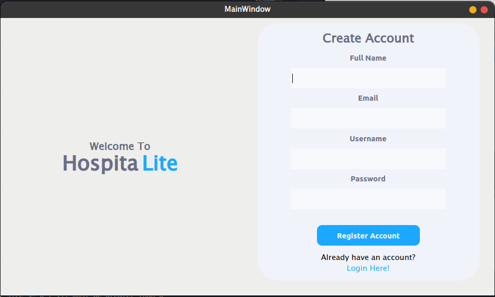
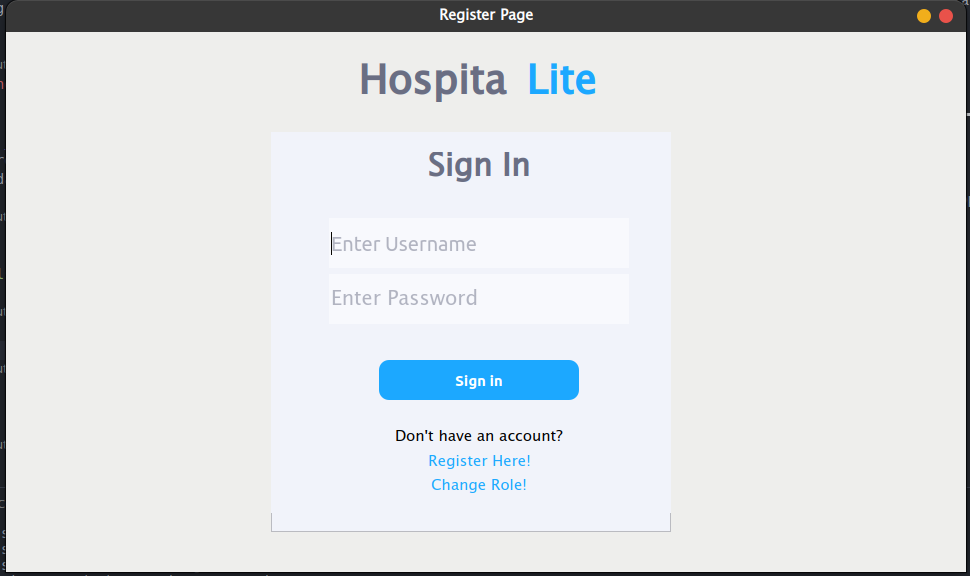
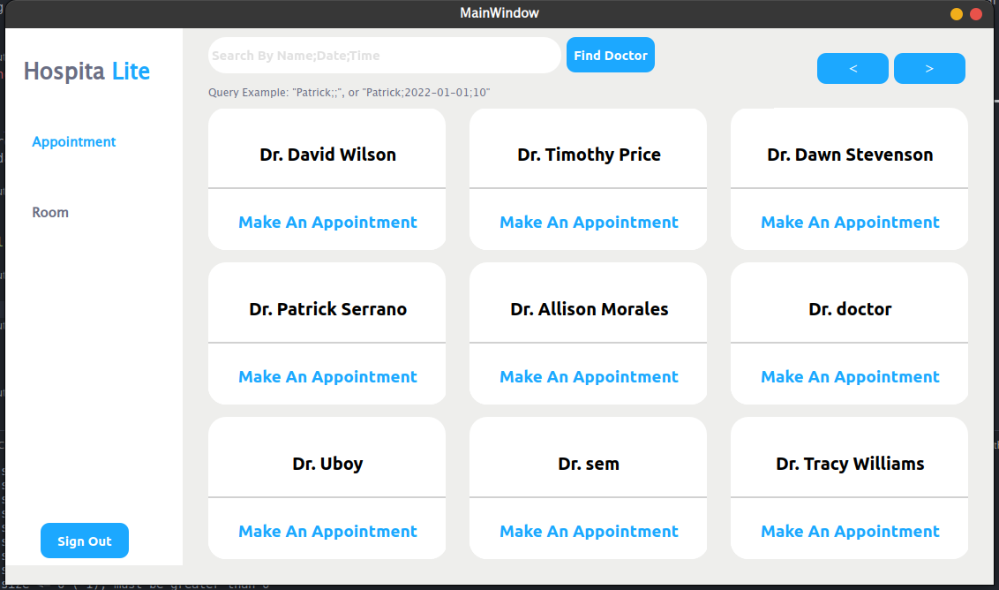
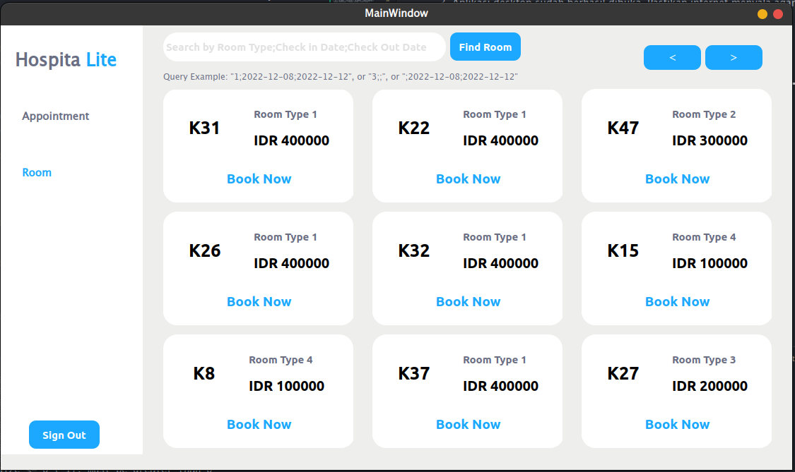

# 🏥 👨‍⚕️ **HospitaLite** 👩‍⚕️ 🚑

Aplikasi berbasis desktop yang bertujuan untuk memudahkan pasien untuk mem-booking jadwal dokter dan kamar sesuai kriteria yang dibutuhkan. Pencarian dokter dapat difilter berdasarkan nama dan jadwal konsultasi sedangkan kamar dapat difilter dengan kelas kamar dan jadwal kedatangan.

## Cara menjalankan aplikasi
---
1. Install requirements.txt dengan cara `pip install -r requirements.txt`
2. Jalankan perintah `python main.py` atau jalankan main.py dengan code runner
3. Aplikasi desktop sudah berhasil dibuka. Pastikan internet menyala agar bisa terhubung ke database cloud.

## Daftar modul yang dimplementasi
---
1. Registrasi Akun : Ubaidillah Ariq 
2. _Sign_ _in_ dan _sign_ _out_ akun : Patrick Amadeus
3. Pencarian dokter berdasarkan filter : Samuel Christopher Swandi
4. Pencarrian kamar berdasarkan filter : Grace Claudia

## _Screenshot_ Modul yang diimplementasikan
--- 

Untuk melihat lebih detail, kalian dapat melihatnya pada pdf `"Screenshot of Hospitalite Features.pdf"` di dalam folder docs

#### Landing Page

#### Register

#### Login

#### Pencarian Dokter 

#### Pencarian Kamar 

## Daftar tabel basis data yang diimplementasi
---

### 1. Pasien 

| id | nama_lengkap | email | password_hashed | riwayat_pasien |
| --- | --- | --- | --- | --- |
|integer | varchar(256) | varchar(256) | varchar(256) | varchar(256) |

### 2. Dokter

| id | nama_lengkap | email | password_hashed | spesialisasi |
| --- | --- | --- | --- | --- |
| integer | varchar(256) | varchar(256) | varchar(256) | varchar(256) |

### 3. Kamar

| id | kelas | harga | 
| --- | --- | --- 
| varchar(256) | integer | integer |

### 4. Booking_konsultasi

| id | id_pasien | id_dokter | harga_konsultasi | tanggal_konsultasi | waktu_mulai |
| --- | --- | --- | --- | --- | --- |
| integer | integer | integer | integer | date | date |

### 5. Booking_kamar

| id | id_kamar | id_pasien | id_dokter | waktu_booking | tanggal_kedatangan | tanggal_pulang | total_biaya |
| --- | --- | --- | --- | --- | --- | --- | --- |
| integer | integer | integer | integer | date | date | date | integer |